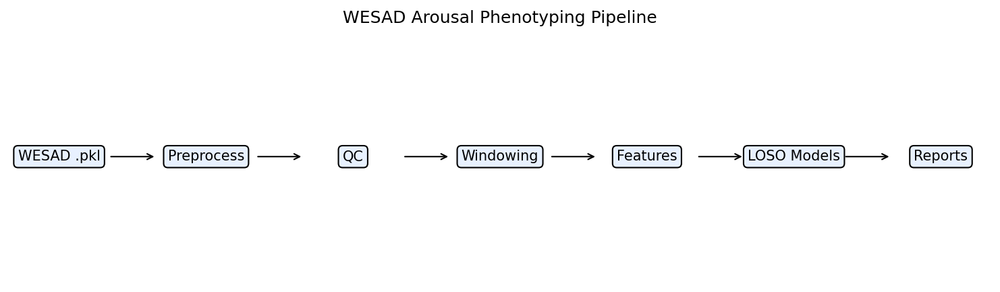
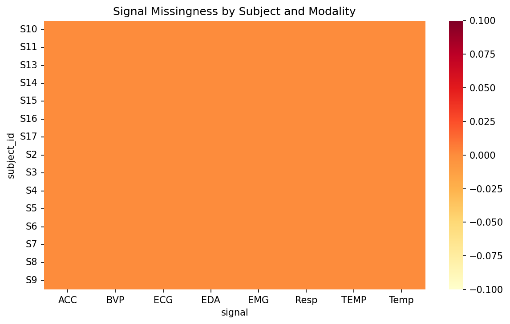
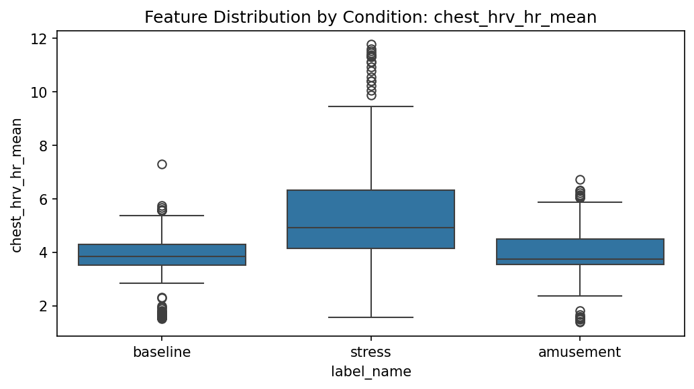
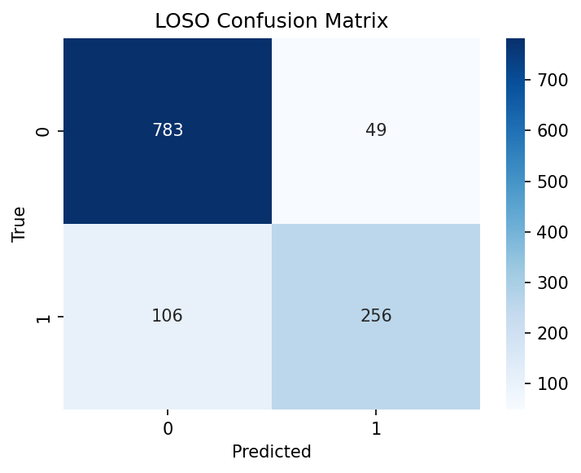
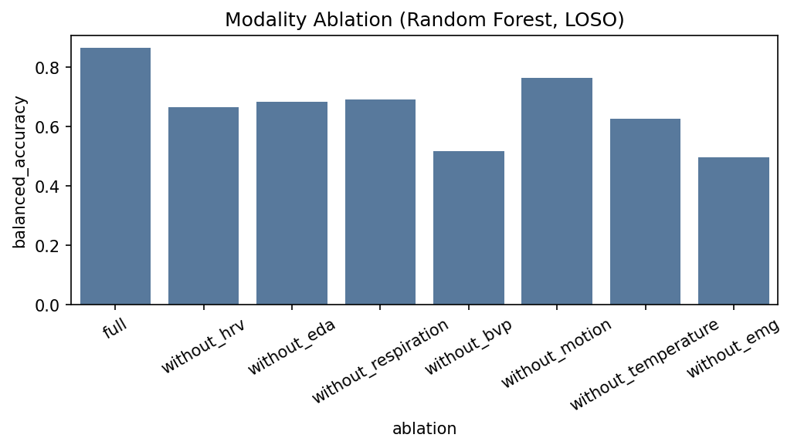
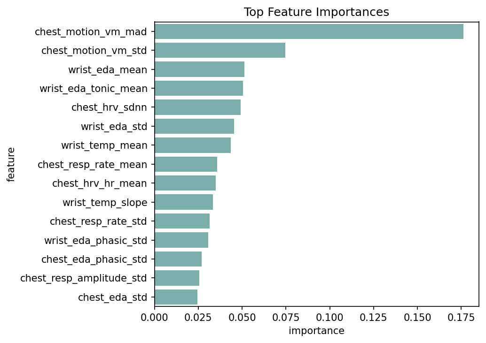

# WESAD Arousal Phenotyping

**A reproducible multimodal wearable physiology pipeline for daytime stress and autonomic arousal phenotyping, built on WESAD as a technical demonstrator for sleep, stress and arousal research workflows.**

[](https://www.python.org/downloads/)
[](LICENSE)

> This project demonstrates robust, reproducible computational workflows for multimodal physiological data: synchronization, artifact handling, quality control, feature extraction, visualization, subject-independent modeling, and interpretable physiological reporting.

---

## Overview

This repository implements a reproducible pipeline for multimodal wearable stress and arousal phenotyping using the [WESAD](https://archive.ics.uci.edu/ml/datasets/WESAD+%28Wearable+Stress+and+Affect+Detection%29) dataset. It processes wrist- and chest-worn physiological signals including ECG, respiration, EDA, BVP, temperature, EMG, and accelerometry; performs signal quality control and windowed feature extraction; evaluates subject-independent stress and affect classification; and generates interpretable visual reports linking autonomic and behavioral physiology to stress and arousal states.

The project is designed as a **research-facing prototype** for mobile and decentralized phenotyping workflows relevant to sleep, stress, arousal, and recovery studies. It intentionally **does not include raw WESAD data** — see [`scripts/download_instructions.md`](scripts/download_instructions.md).



---

## Why This Matters for Sleep, Stress and Arousal Research

WESAD does not contain overnight sleep recordings. This repository frames the work honestly as a **daytime stress/arousal pipeline** that transfers to sleep and home-monitoring research through shared methods:

- Multimodal biosignal preprocessing and synchronization
- Transparent artifact and quality-control reporting
- Windowed feature extraction from wearable physiology
- Subject-independent (LOSO) machine learning evaluation
- Modality ablation and physiological interpretation

These are the same building blocks needed for decentralized phenotyping in sleep, stress, recovery, and mobile-health studies.

---

## Dataset

| Property | Value |
|---|---|
| Subjects | 15 |
| Devices | RespiBAN (chest), Empatica E4 (wrist) |
| Conditions | Baseline, stress (TSST), amusement |
| Signals | ECG, EDA, EMG, respiration, BVP, temperature, accelerometry |

**Label encoding:** baseline = 1, stress = 2, amusement = 3; transitional codes are excluded by default.

---

## Pipeline

```text
WESAD .pkl  →  Preprocess  →  QC  →  Windowing  →  Features  →  LOSO Models  →  Reports
```

1. **Data ingestion** — load subject `.pkl` files, standardize labels, save interim parquet
2. **Quality control** — missingness, flatlines, out-of-range values, window exclusion
3. **Windowing** — 60 s windows, 30 s step, majority-vote labels (≥ 80% purity)
4. **Feature extraction** — HRV, EDA tonic/phasic, respiration, BVP, motion, temperature, EMG
5. **Modeling** — Dummy, Logistic Regression, Random Forest, Gradient Boosting with LOSO CV
6. **Reporting** — QC tables, confusion matrices, ablation charts, feature importance

---

## Installation

```bash
python -m venv .venv
# Windows
.venv\Scripts\activate
# macOS/Linux
source .venv/bin/activate

pip install -r requirements.txt
pip install -e .
```

Or with conda:

```bash
conda env create -f environment.yml
conda activate wesad-arousal-phenotyping
pip install -e .
```

---

## Reproducing the Analysis

1. Download WESAD and place subject folders under `data/raw/WESAD/` (see [`scripts/download_instructions.md`](scripts/download_instructions.md)).

2. Run the pipeline:

```bash
python scripts/run_preprocess.py --config configs/default.yaml
python scripts/run_extract_features.py --config configs/default.yaml
python scripts/run_train.py --config configs/default.yaml --task binary
python scripts/run_evaluate.py --config configs/default.yaml
python scripts/make_report.py --config configs/default.yaml
```

3. Run tests (synthetic data only):

```bash
pytest -q
```

---

## Quality Control

Automated QC metrics are computed per subject and sensor:

- Missingness and flatline fraction
- Out-of-range values and abrupt jumps
- Label coverage per condition
- ECG R-peak detection success rate
- EDA valid-range percentage
- Window exclusion counts (mixed-label windows)

Example output: [`reports/example_qc_report.md`](reports/example_qc_report.md)



---

## Feature Extraction

Sliding windows (default 60 s / 30 s step) produce one row per subject-window with interpretable features:

| Family | Examples |
|---|---|
| HRV | HR mean/std, RMSSD, SDNN, pNN50 |
| EDA | tonic/phasic mean, SCR count/amplitude |
| Respiration | breathing rate, amplitude, plausibility |
| BVP | pulse rate, pulse variability |
| Motion | vector magnitude mean/std/energy |
| Temperature | mean, slope, range |
| EMG | RMS, MAD, spectral energy |



---

## Modeling and Evaluation

**Primary evaluation:** leave-one-subject-out (LOSO) cross-validation — no random window splits across subjects.

**Metrics:** balanced accuracy, macro F1, ROC-AUC (binary stress detection), confusion matrix, per-subject performance.

**Comparisons:**
- Chest only (`configs/sensors_chest.yaml`)
- Wrist only (`configs/sensors_wrist.yaml`)
- Chest + wrist (`configs/default.yaml`)
- Feature-group ablation (HRV, EDA, respiration, motion, temperature, BVP, EMG)

---

## Results

Leave-one-subject-out (LOSO) evaluation on 15 WESAD subjects, 1,194 windows (60 s / 30 s step):

### Binary stress vs non-stress

| Model | Sensors | Task | CV | Balanced Accuracy | Macro F1 | ROC-AUC |
|---|---|---|---|---:|---:|---:|
| Dummy baseline | chest+wrist | binary | LOSO | 0.52 | 0.52 | 0.52 |
| Logistic Regression | chest+wrist | binary | LOSO | 0.85 | 0.84 | 0.93 |
| Random Forest | chest+wrist | binary | LOSO | **0.86** | **0.88** | **0.96** |
| Gradient Boosting | chest+wrist | binary | LOSO | **0.90** | **0.90** | **0.97** |
| Random Forest | chest only | binary | LOSO | 0.80 | 0.79 | 0.94 |
| Random Forest | wrist only | binary | LOSO | 0.82 | 0.83 | 0.92 |

### Three-class (baseline / stress / amusement)

| Model | Sensors | Balanced Accuracy | Macro F1 |
|---|---|---:|---:|
| Logistic Regression | chest+wrist | 0.70 | 0.66 |
| Random Forest | chest+wrist | 0.68 | 0.67 |
| Gradient Boosting | chest+wrist | 0.69 | 0.67 |

### Modality ablation (Random Forest, LOSO)

Removing **HRV** or **EDA** features causes the largest drop in balanced accuracy (~0.86 → ~0.67–0.69), suggesting autonomic cardiac and electrodermal markers are the most informative modalities in this pipeline.





---

## Physiological Interpretation

Expected stress-associated **markers** (not causal claims):

- Increased heart rate and reduced HRV variability during stress
- Elevated EDA phasic activity and SCR frequency
- Shifts in respiration rate and irregularity
- Motion artifacts may confound wrist-worn signals

Feature importance and ablation analyses help identify which modalities contribute most robustly under subject-independent evaluation.

---

## Limitations

- WESAD is a small laboratory dataset (15 subjects).
- The dataset contains **daytime stress and affect states, not overnight sleep**.
- Results may not transfer directly to home-based sleep studies.
- Subject-independent evaluation is essential — random window splits inflate performance.
- Wearable signals are affected by motion artifacts, device placement, and individual physiology.

---

## Repository Structure

```text
configs/           YAML configuration (default, chest-only, wrist-only)
scripts/           CLI entry points for reproducible analysis
src/wesad_arousal/ Core library (data, QC, features, modeling, reporting)
tests/             Unit tests with synthetic toy data
notebooks/         Exploratory analysis notebooks
reports/           Generated figures and tables
data/              Local data (raw/interim/processed — gitignored)
outputs/           Metrics and QC CSVs (gitignored)
```

---

## Citation

If you use this pipeline, please cite the original WESAD dataset:

```bibtex
@inproceedings{schmidt2018introducing,
  title={Introducing WESAD, a Multimodal Dataset for Wearable Stress and Affect Detection},
  author={Schmidt, Philip and Reiss, Attila and Duerichen, Robert and Marberger, Claus and Van Laerhoven, Kristof},
  booktitle={Proceedings of the 20th ACM International Conference on Multimodal Interaction},
  pages={400--408},
  year={2018}
}
```

---

## PhD Application Note

> To demonstrate fit with sleep/stress/arousal phenotyping research, I built a reproducible WESAD-based wearable physiology pipeline emphasizing multimodal preprocessing, QC, feature extraction, subject-independent modeling, and interpretable reporting. Raw data are excluded from the repository; evaluation uses leave-one-subject-out cross-validation to avoid identity leakage.

**GitHub description:** Reproducible multimodal wearable physiology pipeline for stress and autonomic arousal phenotyping using WESAD, with QC, feature extraction, subject-independent modeling, and interpretable reports.
