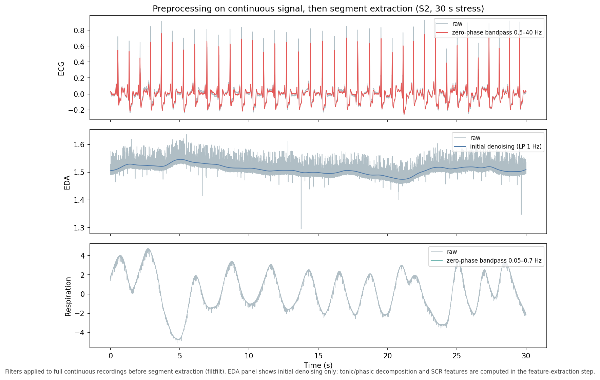
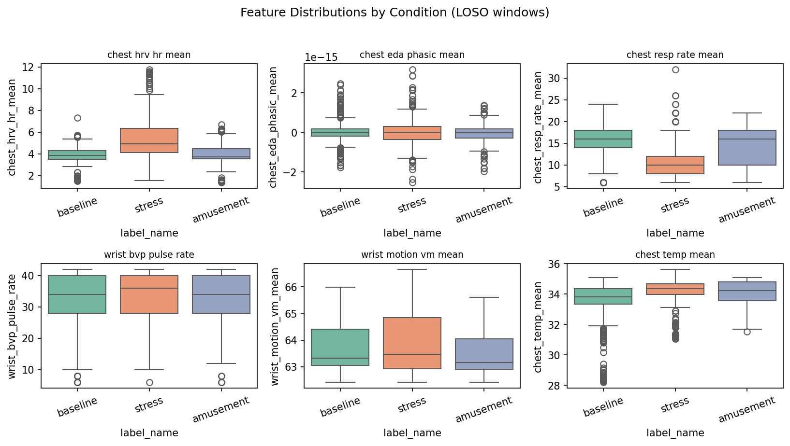
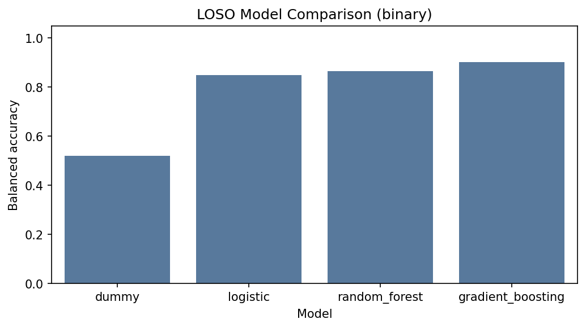
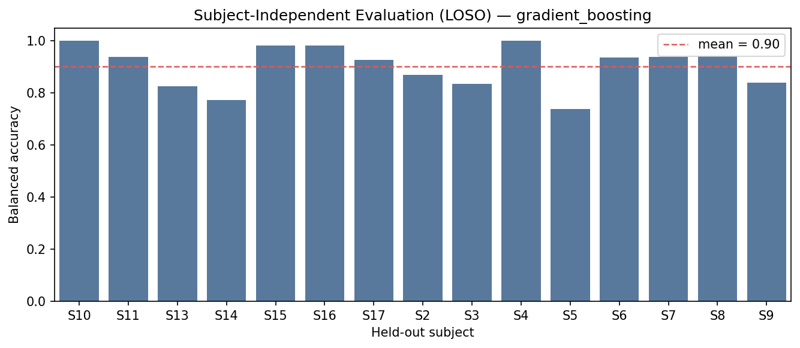

# WESAD Arousal Phenotyping

[](https://www.python.org/downloads/)
[](LICENSE)

## Motivation

This repository is a reproducible technical portfolio for wearable physiological stress/arousal phenotyping, created as preparation for research on sleep, stress, arousal, recovery, and mobile health sensing.

It implements end-to-end workflows for multimodal wearable biosignals: ingestion, preprocessing, quality control, windowed feature extraction, subject-independent evaluation, and interpretable reporting.

---

## Dataset

This project uses the [WESAD](https://archive.ics.uci.edu/ml/datasets/WESAD+%28Wearable+Stress+and+Affect+Detection%29) dataset (15 subjects; chest RespiBAN + wrist Empatica E4; baseline, stress, amusement).

Due to dataset licensing, **raw data are not redistributed**. Request or download WESAD from the official source and place subject folders under `data/raw/WESAD/`. See [`scripts/download_instructions.md`](scripts/download_instructions.md).

| Property | Value |
|---|---|
| Subjects | 15 |
| Devices | RespiBAN (chest), Empatica E4 (wrist) |
| Conditions | Baseline, stress (TSST), amusement |
| Signals | ECG, EDA, EMG, respiration, BVP, temperature, accelerometry |

---

## Pipeline

1. **Data ingestion** — load WESAD `.pkl` files, standardize labels, save interim parquet per subject
2. **Preprocessing and quality checks** — filtering, artifact metrics, label coverage, window exclusion
3. **Feature extraction** — sliding windows (60 s / 30 s step); HRV, EDA, respiration, BVP, motion, temperature, EMG
4. **Subject-independent evaluation** — leave-one-subject-out (LOSO) classification; chest / wrist / combined comparisons
5. **Visualization and reporting** — QC heatmaps, preprocessing examples, feature distributions, model metrics, ablation

```text
WESAD .pkl  →  Preprocess  →  QC  →  Windowing  →  Features  →  LOSO Models  →  Reports
```


### Signal preprocessing methodology

All filtering uses **zero-phase Butterworth filters** (`scipy.signal.filtfilt`) applied to the **full continuous recording before segment/window extraction**, to reduce edge artifacts and avoid phase shifts in R-peak timing.

| Signal | Step shown in figure | Feature-extraction step |
|---|---|---|
| **ECG** | Zero-phase bandpass **0.5–40 Hz** | R-peak detection and HRV (RMSSD, SDNN, pNN50, etc.) on filtered windows |
| **EDA** | Initial denoising — low-pass **1 Hz** only | Tonic/phasic decomposition (NeuroKit2), SCR count and amplitude on windowed segments |
| **Respiration** | Zero-phase bandpass **0.05–0.7 Hz** | Breathing rate, amplitude, plausibility (preserves stress-related faster breathing better than a 0.5 Hz low-pass) |

> **Note:** The figure below shows a **representative 30-second stress segment for visual inspection** after continuous-signal filtering. Model evaluation uses **leave-one-subject-out (LOSO)** splits to reduce subject leakage.

**EDA initial denoising / smoothing** (not the full SCR analysis pipeline):



Window-level EDA features additionally include tonic mean, phasic mean/std, SCR count, and SCR amplitude. SCR rise time, recovery time, and stimulus-locked latency are **not** implemented in this version.

---

**Quality control** — missingness heatmap by subject and sensor modality:


**Feature distributions** — extracted window-level features by condition (baseline / stress / amusement):




---

## Relevance to Sleep, Stress and Arousal Research

This project demonstrates experience with wearable physiological signals, stress/arousal-related modelling, reproducible preprocessing, and analysis workflows relevant to mobile and decentralized phenotyping.

Concrete capabilities reflected in the codebase:

- Multimodal biosignal preprocessing and synchronization (ECG, EDA, respiration, BVP, accelerometry, temperature)
- Transparent QC and artifact screening suitable for real-world sensing pipelines
- Windowed physiological feature extraction with interpretable autonomic markers
- Subject-independent evaluation (LOSO) to avoid identity leakage
- Modality ablation and feature-importance analysis for physiological interpretation

WESAD does not contain overnight sleep recordings; this repo is framed as a **daytime stress/arousal platform** whose methods transfer to sleep-adjacent and recovery monitoring research.

---

## Reproducibility

### Python version

Python **3.10+** recommended.

### Dependencies

```bash
pip install -r requirements.txt
```

Core stack: `numpy`, `pandas`, `scipy`, `scikit-learn`, `matplotlib`, `seaborn`, `neurokit2`, `PyYAML`, `pyarrow`, `joblib`, `tqdm`, `pytest`.

Alternatively:

```bash
conda env create -f environment.yml
conda activate wesad-arousal-phenotyping
```

### Commands

```bash
python -m venv .venv
# Windows: .venv\Scripts\activate
# macOS/Linux: source .venv/bin/activate

pip install -r requirements.txt

# Place WESAD under data/raw/WESAD/, then:
python scripts/run_preprocess.py --config configs/default.yaml
python scripts/run_extract_features.py --config configs/default.yaml
python scripts/run_train.py --config configs/default.yaml --task binary
python scripts/run_evaluate.py --config configs/default.yaml
python scripts/make_report.py --config configs/default.yaml

pytest -q
```

### Expected outputs

| Path | Description |
|---|---|
| `data/interim/` | Per-subject parquet (gitignored) |
| `data/processed/features.parquet` | Window-level feature matrix (gitignored) |
| `outputs/qc_metrics.csv` | QC metrics per subject and sensor (gitignored) |
| `outputs/metrics_*.json` | LOSO evaluation results (gitignored) |
| `reports/figures/` | Pipeline, preprocessing, QC, distributions, LOSO, ablation plots |
| `reports/tables/` | Feature importance, ablation, results summary CSVs |
| `reports/example_qc_report.md` | Example QC markdown report |

### Folder structure

```text
configs/           YAML configuration (default, chest-only, wrist-only)
scripts/           CLI entry points
src/wesad_arousal/ Core library (data, QC, features, modeling, reporting)
tests/             Unit tests (synthetic data)
notebooks/         Exploratory notebooks
reports/           Generated figures and tables (committed examples)
data/              Local raw/interim/processed data (gitignored)
outputs/           Metrics and QC CSVs (gitignored)
```

---

## Results (LOSO, 15 subjects, 1,194 windows)

| Model | Sensors | Balanced Acc | Macro F1 | ROC-AUC |
|---|---|---:|---:|---:|
| Dummy baseline | chest+wrist | 0.52 | 0.52 | 0.52 |
| Logistic Regression | chest+wrist | 0.85 | 0.84 | 0.93 |
| Gradient Boosting | chest+wrist | **0.90** | **0.90** | **0.97** |
| Random Forest | chest+wrist | 0.86 | 0.88 | 0.96 |
| Random Forest | wrist only | 0.82 | 0.83 | 0.92 |
| Random Forest | chest only | 0.80 | 0.79 | 0.94 |

**Subject-independent evaluation** — LOSO model comparison and per-subject balanced accuracy:




**Confusion matrix** (best LOSO model, aggregated folds):


**Interpretation** — feature importance and modality ablation (Random Forest, LOSO):


---

## Limitations

This is a **public-dataset technical portfolio** rather than a sleep study. WESAD does not directly measure sleep physiology, but it provides a useful platform for practicing wearable stress/arousal analysis.

Additional constraints:

- Small laboratory cohort (15 subjects); results may not generalize to home-based or clinical populations
- Daytime stress and affect states only — not overnight sleep architecture or circadian endpoints
- Wearable signals are sensitive to motion artifacts, device placement, and individual physiology
- Subject-independent evaluation (LOSO) is required; random window splits across subjects inflate performance

---

## Citation

If you use this pipeline, please cite the original WESAD dataset:

```bibtex
@inproceedings{schmidt2018introducing,
  title={Introducing WESAD, a Multimodal Dataset for Wearable Stress and Affect Detection},
  author={Schmidt, Philip and Reiss, Attila and Duerichen, Robert and Marberger, Claus and Van Laerhoven, Kristof},
  booktitle={Proceedings of the 20th ACM International Conference on Multimodal Interaction},
  pages={400--408},
  year={2018}
}
```
